# Data Model — OEE → Revenue → CM (v1.9.0)

Domain skin: **imaginary dairy factory** (SKU/line/reason/location names). Analytical grains and PK/FK unchanged from v1.9.0.

## Pattern

**Kimball star schema** with one **bridge** and **derived analytical facts**.

### Hybrid integrity (v1.7+)

| Layer | Mechanism |
|-------|-----------|
| **Python** | Business-rule validation (OEE bounds, gap waterfall, CM identity, PVM, capacity slack, domain rules) → `final/integrity_checks.json` (24/24) |
| **SQLite** | Relational integrity via `05_build_sqlite_with_keys.py`: `PRIMARY KEY`, `FOREIGN KEY`, `PRAGMA foreign_keys=ON`, orphan-rejection test, `PRAGMA foreign_key_check` |

Natural/business keys (`ProductID`, `LineID`, `DateKey`, `PeriodKey`, …) are intentional for this synthetic warehouse. Surrogate keys are **not** required unless SCD2 / multi-source master data is introduced.

## Architecture (layers)

```text
DIMENSIONS
     │
     ├── Production / Downtime / Sales   (daily DateKey)
     ├── Demand / Inventory / Financial  (monthly PeriodKey)
     └── Bridge_ProductLineCapability
              │
              ▼
     FactOEE_Run  +  FactImpact_ProductPeriod
              │
     ┌────────┼────────┐
     ▼        ▼        ▼
   PVM   Opportunity  Scenarios → Executive outputs
```

## Dimensions

| Table | Grain / key |
|-------|-------------|
| DimDate | `DateKey` YYYYMMDD |
| DimPeriod | `PeriodKey` YYYYMM |
| DimProduct | `ProductID` |
| DimLine | `LineID` |
| DimEquipment | `EquipmentID` (→ Line) |
| DimDowntimeReason | `DowntimeReasonID` |
| DimScenario | `ScenarioID` |
| DimLocation | `LocationID` |

## Bridge

| Table | Keys |
|-------|------|
| Bridge_ProductLineCapability | ProductID × LineID (+ capability attributes) |

## Base facts

| Table | Grain (PK) | Time key |
|-------|------------|----------|
| FactProduction | run / daily operational | DateKey |
| FactDowntime | event / daily | DateKey |
| FactSales | Product × Date (no LineID) | DateKey |
| FactDemand | Product × Period × Scenario × DemandType | PeriodKey |
| FactFinancialPlan | Product × Period × Scenario | PeriodKey |
| FactInventorySnapshot | **Product × Period × Location** | PeriodKey |

## Derived / analytical facts

| Table | Grain (PK) | Notes |
|-------|------------|--------|
| FactOEE_Run | 1:1 with production run | A×P×Q decomposition |
| FactImpact_ProductPeriod | **PeriodKey × ProductID** | `LineID` = **primary/allocated** analytical attribute, **not** multi-line grain |
| PVM_Bridge | Product × Period | Actual vs Budget revenue bridge |
| Scenario_Results | ScenarioID (+ metrics) | `NetCMImpact_after_RecoveryCost` ≠ baseline NetCMOpportunity |
| Opportunity_Prioritization | ranked Product×Period | Prefer rank by NetCMOpportunity |
| CaseTrace | diagnostic rows | classification of impact cases |

## FactInventorySnapshot — semantic note (important)

**Documented grain:** Product × Period × Location.

| Column group | True analytical grain | Aggregation by Location |
|--------------|----------------------|-------------------------|
| `FGInventory`, `BlockedInventory`, `SafetyStock`, `UsableInventory`, WIP-style | **Location-level state** | OK |
| `OpeningInventory`, `OpeningAvailableInventory`, `GoodProduction`, `Shipments`, `ClosingInventory` | **Product × Period flow** (replicated / presentational across locations in this synthetic design) | **Do not SUM by Location** — risk of double-count |

Location split for flow measures is **presentational** in this portfolio. Dashboard and PBI models should either:

- aggregate flow measures only at Product×Period, or  
- treat flow columns as `ProductPeriod_*` attributes and hide them from location-level visuals.

A separate `FactInventoryFlow` is **not** required for v1.9.0; Impact already carries the analytical absorption path (`InventoryAbsorbed`, `GrossGap`, …).

## Impact grain (frozen)

```text
PK = (PeriodKey, ProductID)
LineID = primary/allocated line (PRIMARY_LINE_RULE)
96 synthetic product-periods; one LineID per Product×Period
```

Do **not** expand PK to Product×Period×Line unless multi-line operational impact becomes a requirement.

## Time grains

| Key | Format | Dimension | Typical facts |
|-----|--------|-----------|---------------|
| DateKey | YYYYMMDD | DimDate | Production, Downtime, Sales, OEE_Run |
| PeriodKey | YYYYMM | DimPeriod | Demand, Inventory, FinancialPlan, Impact, PVM |

## Inventory shipping rule

- `SAME_PERIOD_SHIP=1`: shipments ≤ opening + good production  
- `SAME_PERIOD_SHIP=0`: shipments ≤ opening only  

## Financial metrics (executive hierarchy)

| Priority | Metric | Role |
|----------|--------|------|
| **Headline** | Net CM opportunity | Modeled mitigation value (ProtectedCM − RecoveryCost) |
| Context | Net CM after **incremental** holding | Proxy: absorbed units × unit holding rate |
| Sensitivity | Net CM after **total FG** holding | Full carrying cost — **not** OEE-attributable |

All are **Modeled / assumption-driven / not a forecast**.

## Mermaid ERD

```mermaid
erDiagram
    DimDate ||--o{ FactProduction : DateKey
    DimDate ||--o{ FactDowntime : DateKey
    DimDate ||--o{ FactSales : DateKey
    DimDate ||--o{ FactOEE_Run : DateKey
    DimPeriod ||--o{ FactDemand : PeriodKey
    DimPeriod ||--o{ FactInventorySnapshot : PeriodKey
    DimPeriod ||--o{ FactFinancialPlan : PeriodKey
    DimPeriod ||--o{ FactImpact_ProductPeriod : PeriodKey
    DimPeriod ||--o{ PVM_Bridge : PeriodKey
    DimProduct ||--o{ FactProduction : ProductID
    DimProduct ||--o{ FactSales : ProductID
    DimProduct ||--o{ FactDemand : ProductID
    DimProduct ||--o{ FactInventorySnapshot : ProductID
    DimProduct ||--o{ FactFinancialPlan : ProductID
    DimProduct ||--o{ FactImpact_ProductPeriod : ProductID
    DimProduct ||--o{ PVM_Bridge : ProductID
    DimProduct ||--o{ Bridge_ProductLineCapability : ProductID
    DimLine ||--o{ FactProduction : LineID
    DimLine ||--o{ FactDowntime : LineID
    DimLine ||--o{ FactImpact_ProductPeriod : LineID
    DimLine ||--o{ Bridge_ProductLineCapability : LineID
    DimLine ||--o{ DimEquipment : LineID
    DimEquipment ||--o{ FactDowntime : EquipmentID
    DimDowntimeReason ||--o{ FactDowntime : DowntimeReasonID
    DimScenario ||--o{ FactDemand : ScenarioID
    DimScenario ||--o{ FactFinancialPlan : ScenarioID
    DimLocation ||--o{ FactInventorySnapshot : LocationID
    FactProduction ||--|| FactOEE_Run : ProductionRunID
```



## Pipeline

```text
01_generate → 02_engine → 03_sensitivity_recovery → 06_sensitivity_same_period_ship
→ tests → 05_sqlite (only keyed DB write) → 04_executive_pack → dashboard
```

Shared pure cost logic: `shared/cost_model.py` (engine + sensitivity).

## Freeze guidance (v1.9.0)

- **Keep** PK/FK natural keys, Impact grain, hybrid integrity.  
- **Do not** add surrogate keys, FactInventoryFlow, or ML for freeze.  
- Remaining work: presentation clarity, not another engine redesign.


## v1.9.0 additions

| Table | Grain |
|-------|--------|
| DimBOMComponent | ComponentID |
| FactBOMUsage | Period × Product × Component |
| FactCOGSVariance | Period × Product |
| PL_Bridge_Summary | Period |

CM (engine) and modeled GP (P&L bridge) use related but not identical cost treatments — see EXECUTIVE_CASE_STUDY.md.
